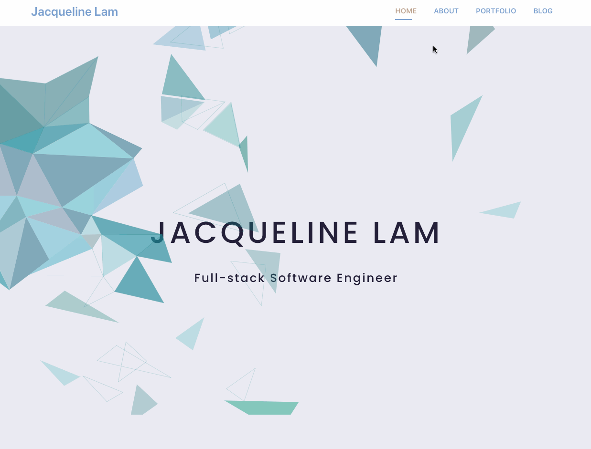

# Personal Portfolio
## Overview
This is a personal portfolio that showcases Jacqueline Lam's projects, software engineering journey, blog posts and more.

The app is composed of backend rails API and front-end React Redux clients, which use asynchronous Javascript (with the help of redux-thunk middleware) to make HTTP requests to the API and render them to the user interface.

* [Video Demo](https://www.youtube.com/watch?v=cTw0wAnVo1c&t=16s)
* [Blog Post pt.1](https://dev.to/jacquelinelam/building-my-personal-portfolio-with-react-redux-pt-1-522k)
* [Blog Post pt.2](https://dev.to/jacquelinelam/building-my-personal-portfolio-with-react-redux-pt-2-3f7o)

## Features
1. User can navigate between home, about, portfolio and blog pages
2. User can filter projects by stacks
3. User can add comments to speciic projects
4. User will have access to the real time blog posts that have been published on dev.to
## Other Features (coming soon)
1. Featured project available on homepage/ about page
2. About page - technical skills to be divided into languages, libraries/ frameworks, databases
3. Project page: project to be displayed as div cards - hover to see description; sort project by date, featured projects (default setting)
4. Blog: sort by date

## Technologies Implemented
1. React.js
2. Redux to manage state
3. Redux-thunk to make use of async actions to send data and receive data from the server
4. react-router with proper RESTful routing
5. Postgres for data persistence
6. Rails API backend to persist data for the application

## Installation
Download zip from my project repository: https://github.com/jacqueline-lam/portfolio

Go to your terminal and change directory:

    $ cd portfolio

If you don't have Ruby, please install Ruby version `ruby 2.6.1`.

 With Rubygems loaded, you can install all of Rails and its dependencies using the following command through the command line:

    $ gem install rails -v 6.0.3

Use the following command to make Rails executable available.

    $ rbenv rehash

More installation instructions can be found on the [Ruby on Rails Guide](https://guides.rubyonrails.org/v5.0/getting_started.html#installing-rails)

Once Ruby and Rails are installed, `cd` into `portfolio-api` and run:

    $ gem install bundler

Bundler gem provides us access to a terminal command: `bundle install`

Install the gems and gem dependencies for this app by running:

    $ bundle install

And then run:

    $ rails db:seed

And then run:

    $ rails s

Lastly, open another tab and `cd` into `portfolio-frontend`, then run:

    $ npm install && npm start

to browse the application in your browser at your localhost.

## Contributing
Bug reports and pull requests are welcome on GitHub at https://github.com/jacqueline-lam/portfolio. This project is intended to be a safe, welcoming space for collaboration, and contributors are expected to adhere to the [Contributor Covenant](http://contributor-covenant.org) code of conduct.

## Authors
Jacqueline Lam - @jacqueline-lam

## License

The code is available as open source under the terms of the [MIT License](https://opensource.org/licenses/MIT).

## Code of Conduct

Everyone interacting in the project’s codebases is expected to follow the [code of conduct](https://github.com/jacqueline-lam/bolderer_sinatra_app/blob/master/CODE_OF_CONDUCT.md).

## Attributions
* Ellipsis/ Spinner loading gif is provided by loading.io
* Homepage SCSS Animation by Lindsay Grizzard (source: freefrontend.com)